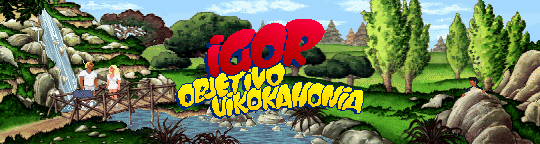

# Reverse Engineering Igor: Objective Uikokahonia



[Igor: Objective Uikokahonia](http://www.mobygames.com/game/igor-objective-uikokahonia) was one of the
first games developed by Pendulo Studios.

I got interested in the game internals after adding support for Flight of the Amazon Queen in ScummVM.
FOTAQ porting was a 3 persons effort (Hey Joost, Hey David). No major reverse engineering was necessary,
the work was done based on the original DOS version C code (itself was a rather interesting port of the
Amiga version original AMOS code).

Once FOTAQ support was complete and [ScummVM 0.6.0](https://adventuregamers.com/news/view/19358) released,
I needed some challenge. I did not know at the time I found one.

I contacted Pendulo Studios back then. They quickly replied they knew about ScummVM and would be glad to help
but unfortunately, the original Pascal code was long lost. With the confirmation of the source code being
unavailable, I started diving into the original executable.

DosBox supported the game quite well at the time, but ScummVM goals were a bit different.

## Data Files

The game exists in four different versions :

* Spanish floppy
* English shareware (demo)
* English floppy
* Spanish CDROM (with speech and digital music sound tracks)

I initially started working from the English demo executable. The game was distributed as shareware back then
as a 2MB zip file.

```
Archive:  IGORDEMO.ZIP
Zip file size: 1998687 bytes, number of entries: 7
2.0 fat   462564 b- defN 95-Jul-24 13:50 IGOR.FSD
2.0 fat  4086790 b- defN 95-Jul-26 12:17 IGOR.DAT
2.0 fat    97920 b- defN 95-Jul-26 12:17 IGOR.EXE
2.0 fat      717 t- defN 95-Jul-26 03:20 FILE_ID.DIZ
2.0 fat     4122 t- defN 95-Jul-26 04:49 ORDER.FRM
2.0 fat      262 t- defN 95-Jul-26 05:05 OPTIK.LST
2.0 fat     3153 t- defN 95-Jul-26 05:10 READ.ME
7 files, 4655528 bytes uncompressed, 1998013 bytes compressed:  57.1%
```

Just by looking at the file extensions and sizes, one would guess the .DAT file contains the game assets
and the .EXE being the engine or the main program. Not exactly...

Let's look at the strings in the executable file and dump the first bytes :

```
$ strings IGOR.EXE
Portions Copyright (c) 1983,92 Borland

$ hexdump -C IGOR.DAT
00000000  46 42 4f 56 fe 5b 3e 00  55 89 e5 b8 3c 00 9a 30  |FBOV.[>.U...<..0|
00000010  05 a0 14 83 ec 3c 8c d3  8e c3 8c db fc 8d 7e ca  |.....<........~.|
```

The program code relies on Borland overlays. The 95kb .EXE file simply contains stubs. The overlays, from
the .DAT file, are loaded when necessary.

Opening the executable in a disassembler confirms this. Each room in the game is actually compiled to its
own segment.

```
stub003:0000 stub003 segment byte public 'STUBSEG' use16
stub003:0000 stru_C70 db 0CDh, 3Fh                   ; int_code
stub003:0000         dw 0                            ; memswap
stub003:0000         dd 8ED6h                        ; fileoff
stub003:0000         dw 0C739h                       ; codesize
stub003:0000         dw 3Ah                          ; relsize
stub003:0000         dw 6                            ; nentries
stub003:0000         dw seg stub002                  ; prevstub
stub003:0000         db 10h dup(0)                   ; workarea
stub003:0020 
stub003:0020         jmp     far ptr WLK_PhilipRoom
stub003:0025         jmp     far ptr TXT_PhilipRoom
stub003:002A         jmp     far ptr IMG_PhilipRoom
stub003:002F         jmp     far ptr PAL_PhilipRoom
stub003:0034         jmp     far ptr MSK_PhilipRoom
stub003:0039         jmp     far ptr BOX_PhilipRoom
```

Each room segment contains the assets data (as static byte arrays) and x86 code (the actual game logic code for the room).

```
walkboxes[320 + 432]
texts[]
background[320 * 144]
palette[240 * 3]
mask[]
objectboxes[]
room logic code
```

The layout varies depending on the room. Some rooms are for example only used during cutscenes and not
playable as such. Walk and Object boxes will not be present.

The only assets not included in the executable are the sounds. IGOR.FSD contains all sounds files concatenated,
the offsets are hardcoded in the executable.

```
$ hexdump -C IGOR.FSD
00000000  31 31 43 72 65 61 74 69  76 65 20 56 6f 69 63 65  |11Creative Voice|
00000010  20 46 69 6c 65 1a 1a 00  0a 01 29 11 01 c3 18 00  | File.....).....|
```


## Engine

At the top level, the engine has a global variable indicating the current room (part) the player is currently in.
When the player changes room, the overlay loader kicks in and loads the corresponding segment in memory.

The main loop is a large switch/case.

```
do {
  switch (_currentPart) {
  case 40:
    PART_04();
    break;
  case 50:
  case 51:
  case 52:
    PART_05();
    break;
  ...
  case 850: // introduction sequence
    _screenVGAVOffset = 24;
    PART_85();
    ...
    _inputVars[kInputCursorXPos] = 160;
    _inputVars[kInputCursorYPos] = 72;
    _system->warpMouse(_inputVars[kInputCursorXPos], _inputVars[kInputCursorYPos]);
    break;
  case 900: // credits
  case 901:
  case 902:
  case 903:
  case 904:
    PART_90();
    break;
} while (_currentPart != kInvalidPart && !_eventQuitGame);
```

The rest of the engine is quite standard. It has the routines and functions you would expect in a point and click adventure game engine :
* walk boxes and path finding
* dialogue trees
* objects and inventory states
* verbs and actions
* cutscenes

## First Recode Attempt

My first attempt was brute force - recode each room one by one. After a few weeks of effort, I got the demo running.

The code was a straight rewrite of x86 disassembly without any effort to refactor. If you are curious, the code can be browsed
from some [ScummVM fork](https://github.com/dreammaster/scummvm/tree/igor/engines/igor). The code is horrible, but that did it.

Once all of the rooms from the demo versions were rewritten, the next step was to continue with the full game.

I quickly lost motivation as rewritting all of that code was tedious. The x86 generated code from the Pascal compiler was very
verbose and not really optimized. I guess the original game code was relying on macros (#define), generating lots of x86 code.

I put the project on hold and moved to other engine rewrites (Another World, Flashback, Bermuda Syndrome...)

## New Approach

Fast forwarding a few years, I got some free time and dusted out the code.

Since the generated x86 code by the Pascal compiler was very verbose and did not look optimized, I started thinking about
interpreting the Intel bytecode directly. The game was compiled in 16 bits mode, which is already a reasonable subset.
I wrote a [x86 parser](https://github.com/cyxx/igor/blob/master/tools/decode_igor/insn_x86.cpp) and fed the executable to it.

That confirmed the Pascal compiler did not do any clever things with the code and rather did a direct translation of the
Pascal statements to the x86 code. The total number of actual required x86 opcodes was also quite small. The basic
switch/case parser is under 700 lines.

Supporting the game on newer platforms could be achieved by simply writing an interpreter or parser for that subset of x86.
I looked at several libraries to deal with x86 code but realized I could write my own since the subset appeared manageable.


## Traps

The game program x86 code could then be parsed but some instructions could not be translated as-is.
Code dealing with I/O for keyboard and mouse, VGA registers for the graphics, SB16 registers for the sound...

From my previous brute force reverse engineering attempt, I had a well mapped and commented disassembly.
With a few exceptions, for each of these low level system accesses, there was a corresponding function.
In total, I isolated 33 high level functions.

Functions dealing with the VGA palette and sound :
```
t 220 0x0002 setPalette_240_16 ()
t 221 0x00BD playMusic (ii)
t 221 0x082F playSound (ii)
t 221 0x094A stopSound ()
t 221 0x2315 setPaletteRange (ii)
t 221 0x21DA setPalette ()
t 221 0x2813 setMousePos ()
t 228 0x0002 setPalette_208_32 ()
```

In addition to the low level functions, the Pascal library functions could also isolated. For example, this allowed to optimize
Pascal String manipulations with native code instead of interpreting it. The same for memcpy/memset calls.

Pascal library runtime functions :
```
t 230 0x0D99 loadString (sisi)
t 230 0x0DB3 copyString (sisii)
t 230 0x0E18 concatString (sisi)
t 230 0x1558 getRandomNumber (i)
t 230 0x1686 memcpy (sisii)
t 230 0x16AA memset (siii)
```

When the Program Counter (CS:IP) of the bytecode interpreter equals  one of these functions addresses (segment:offset),
some native code is executed. I named these "traps" but an alternative name could have been "syscalls".

This HLE approach worked well for most of the cases, still there were corners cases to handle.
Some examples..

### Busy Waiting

Under DOS, only one program is running at a time.
It is not uncommon to have while(1) loops spinning the CPU while waiting for some conditions (typically set in an interrupt vector).


```
loc_74003:
  les di, dword ptr stru_885460.ptr
  cmp word ptr es:[di], 0
  jnz short loc_74003
```

### Direct Register Write

Some game code would change some palette color entries.
Under DOS, that was done by manipulating the 0x3C8/0x3C9 registers.

```
  mov al, 0xF0h
  mov dx, 3C8h
  out dx, al
  mov al, [bp+arg_8]
  mov dx, 3C9h
  out dx, al
  mov al, [bp+arg_6]
  mov dx, 3C9h
  out dx, al
  mov al, [bp+arg_4]
  mov dx, 3C9h
  out dx, al
```

### DOS Interruption

During cutscenes or puzzles, the mouse position is restricted. These are set via the DOS 0x33 interrupt.

```
  mov ax, 8
  mov cx, 0
  mov dx, 8Fh
  int 33h
```

I added some code to detect these instruction sequences and defined new traps to execute equivalent code.
Only 11 new traps were necessary.

```
#define trap_loadActionData    0x0001
#define trap_setPaletteColor   0x0002
#define trap_loadImageData     0x0003
#define trap_setActionData     0x0004
#define trap_setDialogueData   0x0005
#define trap_loadDialogueData  0x0006
#define trap_setPaletteData    0x0007
#define trap_loadPaletteData   0x0008
#define trap_waitInput         0x0009
#define trap_setMouseRange     0x000A
#define trap_waitSound         0x000B
```

## Game Assets and Code

I got to the point where all of the game code could be parsed and the DOS low level calls replaced with higher level functions.

The next (and final) step was to extract all the assets and the actual game code from the original .DAT and .EXE files.
I wrote some dedicated tools for that (decode_igor and compile_igor) and an interpreter to run the generated files.

The new game interpreter fits in 168Kb (igor.dll), the original game code is 2.8MB (igor.bin). The game code could be reduced further.

```
Archive:  igor-0.1.9-gl-win32.zip
Zip file size: 528868 bytes, number of entries: 5
2.0 unx  2885852 b- defN 17-Feb-05 09:40 igor.bin
2.0 unx   168960 b- defN 17-Apr-30 21:24 igor.dll
2.0 unx    96215 b- defN 17-Jan-09 18:40 igor_english.txt
2.0 unx    35328 b- defN 17-Apr-30 21:24 game.exe
2.0 unx     1210 b- defN 17-Jan-09 18:40 README.TXT
5 files, 3187565 bytes uncompressed, 528366 bytes compressed:  83.4%
```

The original .FSD, .DAT and .EXE files are still necessary for the game assets.


## Porting to Android

With the game running on newer platforms (thanks to SDL),
I thought it would be interesting to also port it to Android. The touch interface usually suits well for this kind of point and click games.
Nowadays SDL2 supports Android, but at the time, SDL 1.2 was still the main release.

Some porting and adaptation was necessary, although, it was quite straightforward :
* the game graphics are rendered to an OpenGL texture
* the game audio CD tracks are compressed with Vorbis and played back via android.media.AudioTrack
* the game speech is compressed with [Speex](https://www.speex.org)
* mouse inputs are translated from touch events

The final APK size is 27MB and contains the full game, a 15:1 compression ratio (a dump of the original CDROM occupies 429MB).

```
Archive:  Igor.apk
Zip file size: 27691365 bytes, number of entries: 1420
2.0 fat     2292 bX defN 17-Apr-30 21:20 AndroidManifest.xml
2.0 fat  9115648 bl defN 17-Apr-30 21:20 assets/IGOR.EXE
1.0 fat     1210 b- stor 80-Jan-01 08:00 assets/es/speech0001.spx
...
1.0 fat     3589 b- stor 80-Jan-01 08:00 assets/es/speech1292.spx
2.0 fat  2885802 bl defN 17-Apr-30 21:20 assets/igor.bin
1.0 fat     7218 b- stor 80-Jan-01 08:00 assets/sound001.wav
...
1.0 fat     7218 b- stor 80-Jan-01 08:00 assets/sound101.wav
1.0 fat  2116828 b- stor 80-Jan-01 08:00 assets/track02.ogg
...
1.0 fat     4122 b- stor 80-Jan-01 08:00 assets/track16.ogg
1.0 fat      691 b- stor 80-Jan-01 08:00 res/drawable/icon.png
2.0 fat      372 bl defN 17-Apr-30 21:20 res/layout/main.xml
1.0 fat      928 b- stor 80-Jan-01 08:00 resources.arsc
2.0 fat   257508 bl defN 17-Apr-30 21:20 classes.dex
2.0 fat    71064 bl defN 17-Apr-30 21:20 lib/x86/libigor-jni.so
2.0 fat    62928 bl defN 17-Apr-30 21:20 lib/armeabi/libigor-jni.so
2.0 fat   108512 bl defN 17-Apr-30 21:20 META-INF/MANIFEST.MF
2.0 fat   108565 bl defN 17-Apr-30 21:20 META-INF/CERT.SF
2.0 fat     1371 bl defN 17-Apr-30 21:20 META-INF/CERT.RSA
1420 files, 35811317 bytes uncompressed, 27514291 bytes compressed:  23.2%
```
